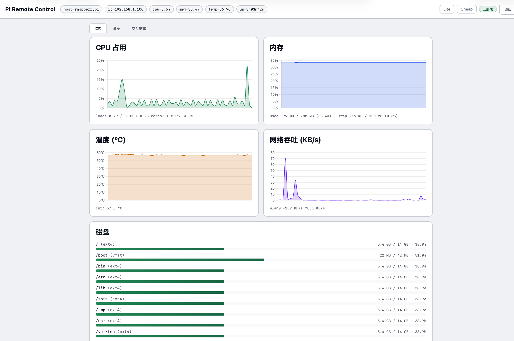
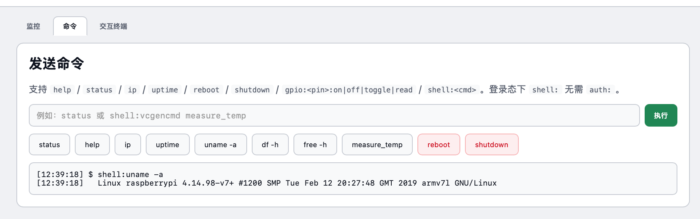
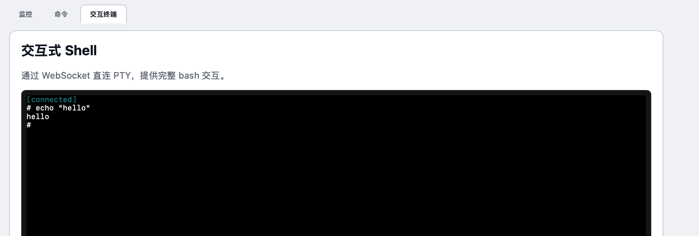
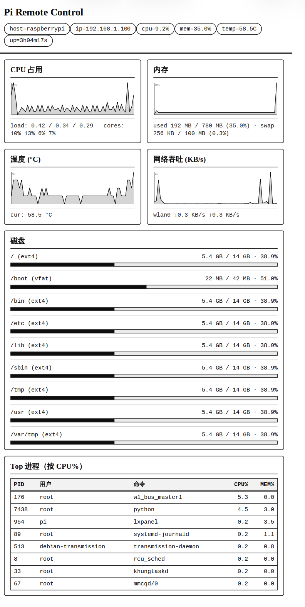

# raspberry_pi_web_interaction

在局域网里用浏览器监控和操作树莓派。作为raspberry connect / teamviewer / vnc的平替。一个轻量 **FastAPI** 服务，无需公网、无需手机 App。

## 它能做什么

### 1. 局域网监控

打开首页即可看到实时仪表盘（CPU / 内存 / 温度 / 网络 / 磁盘 / Top 进程），Chart.js 折线图 + SSE 推送，适合电脑和现代浏览器。

```
http://<树莓派IP>:8080/
```



### 2. 快捷命令与 Shell（可扩展）

点击右上角 **Deploy** 输入密码后解锁：

- **命令**：文本协议（`status`、`gpio:17:toggle`、`shell:vcgencmd measure_temp` 等），方便脚本和二次开发
- **交互终端**：xterm.js + WebSocket PTY，体验接近 SSH

协议集中在 `pi_remote_core/commands.py`，新增命令只需改一处。





💡 **上面两个功能实现了web端的输入和输出，配合其他硬件拓展模块，可以自行搭建更多的监控和命令。**

### 3. Lite / Cheap — 廉价设备也能看

| 路由 | 适合 | 说明 |
|------|------|------|
| `/lite` | 电脑 / 老浏览器 | HTML + SVG 矢量图，折线清晰 |
| `/cheap` | Kindle、极老设备 | 自动刷新的 PNG（默认 Paperwhite 5：1236×1648） |

两者共用 `web_pi_control/kindle_html.py` 一套模板；改这个文件，`/lite` 和 `/cheap` 同步更新。

```
http://<树莓派IP>:8080/lite     # 廉价监控（SVG）
http://<树莓派IP>:8080/cheap    # Kindle 上用（PNG）
```



`/cheap` 需要 `chromium-browser`（`install.sh` 会尝试安装）。诊断：

```bash
curl http://<pi>:8080/api/kindle/status
```

---

## 快速开始

```bash
git clone https://github.com/dingyuan-shi/raspberry_pi_web_interaction.git
cd raspberry_pi_web_interaction
sudo ./install.sh

# 安装后务必修改默认密码
sudoedit /etc/default/web-pi-control
sudo systemctl restart web-pi-control
```

浏览器访问 `http://<树莓派IP>:8080`。

卸载：`sudo ./uninstall.sh`

---

## 路由一览

```
/                       监控仪表盘（公开）
/lite                   SVG 精简监控页
/cheap                  PNG 监控页（Kindle）
/api/cheap.png          cheap 图源
/api/status             状态 JSON
/api/status/stream      状态 SSE
/api/monitor            详细监控（?history=N）
/api/monitor/stream     监控 SSE
POST /login             Deploy 登录
POST /api/command       执行命令（需登录）
WS   /api/shell         交互终端（需登录）
```

---

## 命令示例

| 命令 | 说明 |
|------|------|
| `help` | 列出命令 |
| `status` | 系统快照 |
| `gpio:<pin>:on\|off\|toggle\|read` | GPIO（白名单引脚） |
| `shell:<cmd>` | 执行 shell |
| `reboot` / `shutdown` | 重启 / 关机 |

```bash
curl -c jar.txt -d 'password=你的密码' http://<pi>:8080/login
curl -b jar.txt -H 'Content-Type: application/json' \
     -d '{"command":"shell:uptime"}' http://<pi>:8080/api/command
```

---

## 配置

文件：`/etc/default/web-pi-control`

| 变量 | 默认 | 说明 |
|------|------|------|
| `WEB_PASSWORD` | `changeme` | **部署后必改** |
| `WEB_SESSION_SECRET` | 安装时随机 | Cookie 签名密钥 |
| `WEB_HOST` | `0.0.0.0` | 监听地址 |
| `WEB_PORT` | `8080` | 端口 |
| `WEB_SESSION_HOURS` | `12` | 会话有效期 |
| `PI_REMOTE_GPIO_PINS` | `17,18,22,...` | GPIO 白名单 |
| `STATUS_INTERVAL` | `5` | SSE 间隔（秒） |

---

## Cheap 分辨率

```
/cheap                              # 默认 1236×1648（Paperwhite 5）
/cheap?w=1072&h=1448               # Paperwhite 4
/cheap?refresh=120                  # 刷新间隔（秒）
```

---

## 项目结构

```
raspberry_pi_web_interaction/
├── docs/screenshots/        # README 截图（watch / lite / cmd / shell）
├── pi_remote_core/          # 命令协议、系统信息采集、配置
├── web_pi_control/          # FastAPI + 前端静态文件
│   ├── kindle_html.py       # lite / cheap 共用仪表盘模板
│   └── static/              # 主页 index.html / app.js / style.css
├── systemd/                 # systemd 单元与默认环境变量
├── install.sh
└── requirements.txt
```

---

## 安全说明

- 仓库内**不包含**任何真实密码或 API Key；默认值仅为 `changeme` 占位符
- `install.sh` 首次安装会生成随机 `WEB_SESSION_SECRET`
- 服务设计为**局域网使用**；若暴露到公网，请改强密码并加反向代理 + TLS
- 监控页公开，命令与终端需 Deploy 登录

---

## License

MIT — 见 [LICENSE](LICENSE)。
